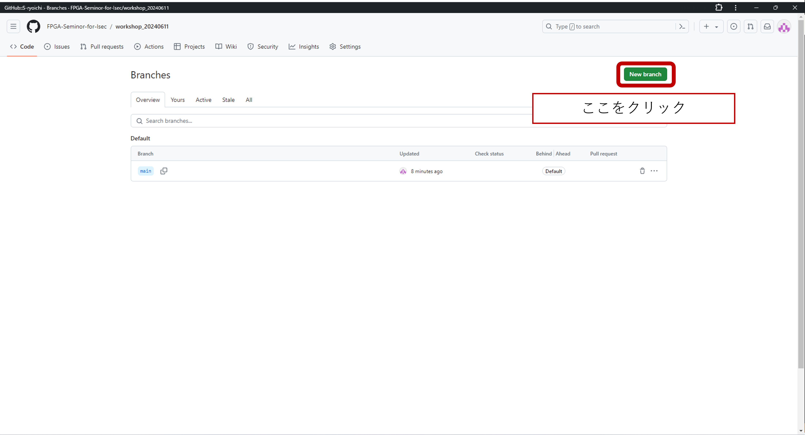
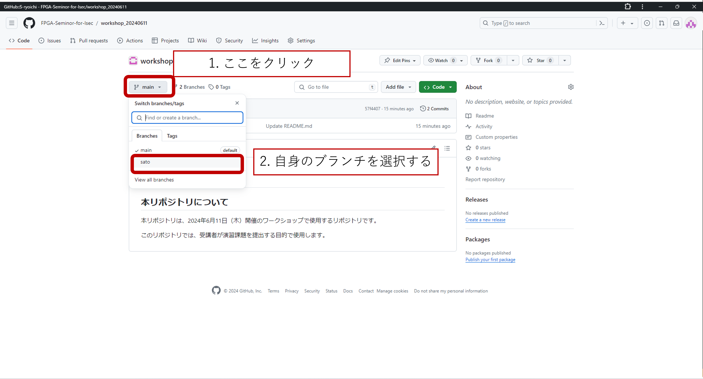
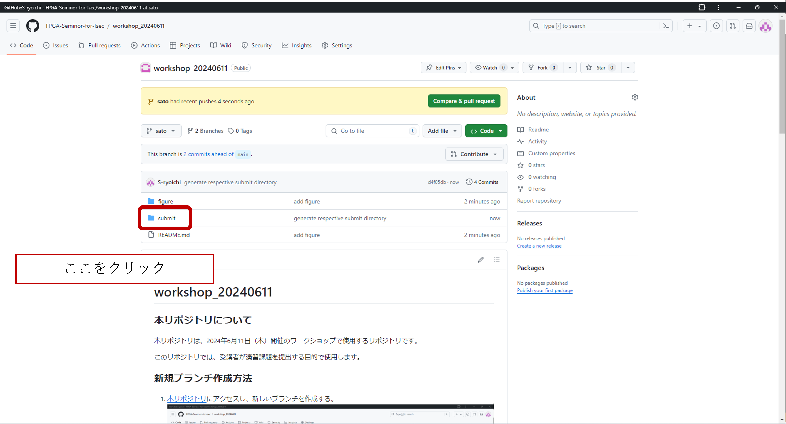
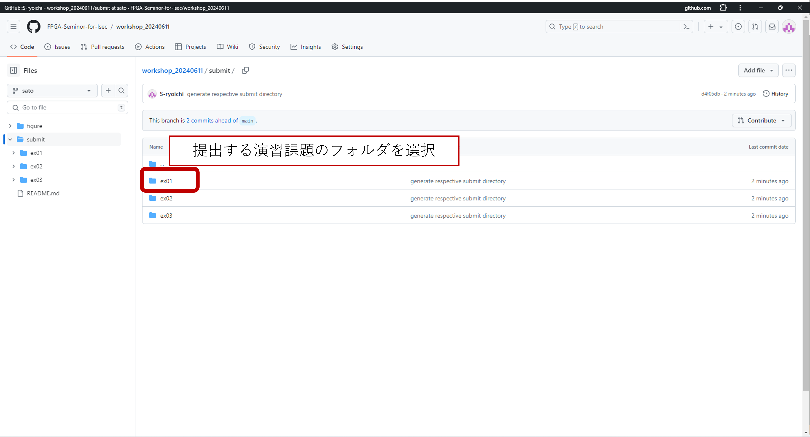

# workshop_20240611

## 本リポジトリについて

本リポジトリは、2024年6月11日（木）開催のワークショップで使用するリポジトリです。

このリポジトリでは、受講者が演習課題を提出する目的で使用します。

## 新規ブランチ作成方法

1. [本リポジトリ](https://github.com/FPGA-Seminor-for-Isec/workshop_20240611)にアクセスし、新しいブランチを作成する。
  
2. 新しいブランチを作成する。
  
3. 自身の名前でブランチを作成する。
  
4. 新規ブランチが作成される
  

## ブランチ選択方法

1. [本リポジトリ](https://github.com/FPGA-Seminor-for-Isec/workshop_20240611)にアクセスし、自身のブランチを選択する。
  
2. 各自のブランチにアクセスしたら、submitフォルダを選択する。
  
3. submitフォルダ配下にある、提出する演習課題のフォルダを選択。
  
4. "Upload files"を選択する。
  
5. 提出するファイルをアップロードし、提出する。
  
6. アップロード完了
  
  
